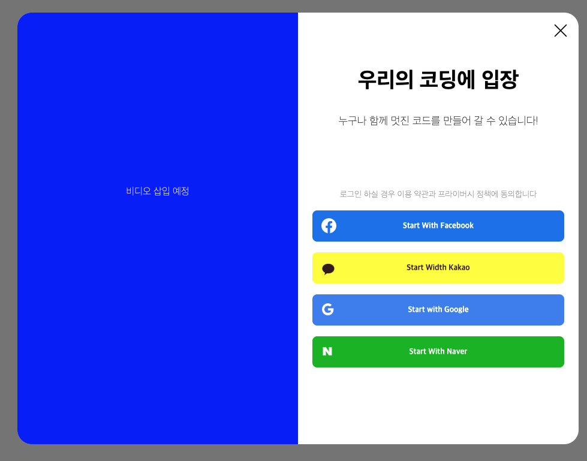

# 웹 실시간 동시 편집기 😀 우리의 코딩 😀
이게 뭐하는 토이프로젝트 라고 한다면... 친구들이랑 코딩 스터디할 때 내코드를 보여주고 수정해주는걸 보여주고 싶을 때가 있자나요.. 근데 복붙하거나 머 다른 훌륭한 에디터도 있지만 채팅도 되고 소스코드에 마킹도하고 누가누가 여기를 추가했습니다! 이런 메타 데이터들을 동적으로 보여주면 더좋을것 같더라고요... ㅎㅎㅎㅎㅎㅎ 그래서 만들어봅니다~

## 토이 프로젝트 목표
- `스마트에디터`의 `문서구조`를 이해하고, 해당 구조를 기반으로 `Operational Transform` 알고리즘을 적용해보자🙏
- `OT` 알고리즘 적용 후 학습 학습~
- WebPack, TypeScript, Node.js, React, Reduct 를 공부하며 적용 🥊
- WebSocekt 구현 (실시간 채팅기능)
- Redis 추가 (실시간 채팅기능, 스마트에디터 빠른 동기화)
- 에디터 드래그 style 추가( 중요한 코드 밑줄!!!!)

## 기대효과
- 스마트에디터 문서구조 기반으로 OT 알고리즘 적용 가능성 검증 및 변경
- 문서 구조 외 OT 알고리즘 구현을 위한 추가적인 필요 기술 공부 (Node.js로 백엔드 구현해보기)
- OT 알고리즘에 대한 검증 및 개발을 용이하게 할 수 있는 데모 페이지 구성


## 관련 링크
실시간 문서 협업은 어떻게 동작할까(출처: 삼성멤버십)
http://www.secmem.org/blog/2019/01/09/operational-transform/

Operational-Transformation/ot.js(출처: github)
http://operational-transformation.github.io/index.html
 
TP1 (출처: https://hackernoon.com/analysing-different-operational-transformation-algorithms-for-collaborative-editing-60fcc49ef24b)

TP2 (출처: https://hackernoon.com/analysing-different-operational-transformation-algorithms-for-collaborative-editing-60fcc49ef24b)

https://ko.reactjs.org/

## UDPATE
### WebPack 설정
- 상대경로 -> 절대경로 추가
- typescript 추가
### Node.js 서버추가.
### Oauth 2.0 로그인 서비스 추가.
- https://redbinalgorithm.tistory.com/687
### Redux 환경 추가
```
- npm install redux react-redux
- npm install redux-thunk
- npm install redux-logger --dev
- npm install react-router-dom react-router-redux history
- npm install redux-devtools-extension --dev
```
- https://redbinalgorithm.tistory.com/688

### Node.js 서버 프로젝트 구조 변경
```
src
│   app.js          # App entry point
└───controller      # Express route controllers for all the endpoints of the app
└───config          # Environment variables and configuration related stuff
└───dto             # Split the startup process into modules
└───repo            # Database models
└───services        # All the business logic is here
└───types           # Type declaration files (d.ts) for Typescript
```

### JWT Token 추가
- https://redbinalgorithm.tistory.com/692
- hader 값으로 jwt token 전달


### 그외 업데이트
#### 로그인 이미지의 디자인이 변경되었습니다.
- 향후 비디오 이미지를 삽입할 예정입니다. (구현 완료후 동작 과정을 삽입 예정)
